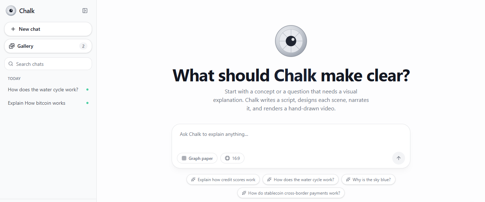
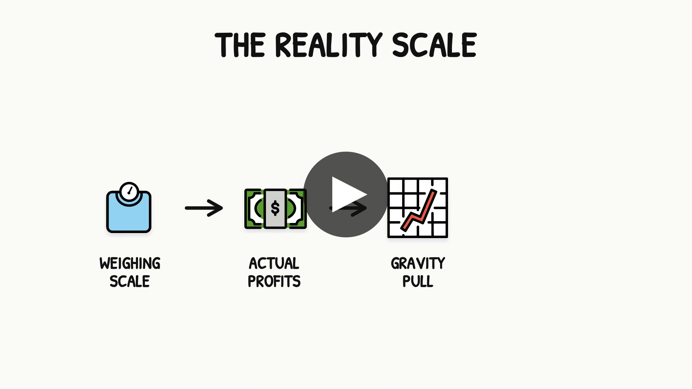
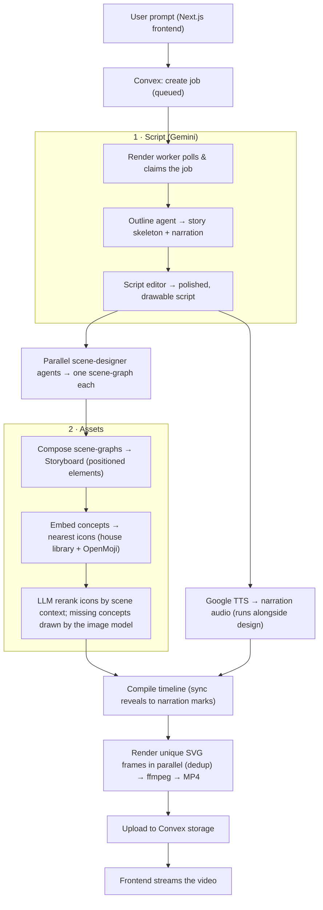

# Chalk — Whiteboard Explainer Video Generator

Turn a one‑line prompt into a narrated, hand‑drawn **whiteboard explainer video** — fully AI‑directed,
scene by scene.

You type *“Explain how credit scores work.”* A chain of AI agents writes a real script, designs each
scene as a diagram, picks the most fitting hand‑drawn icons, narrates it, and renders a synced **MP4**
where every element draws itself in as it’s spoken.



> **Chalk** is the app / UI. Under the hood it’s a deterministic layout‑and‑animation engine driven by
> a small fleet of Gemini agents and Google Cloud Text‑to‑Speech.

## ▶ Demo video

Click the poster to watch a full generated explainer (an MP4 rendered by this pipeline):

[](demo/final.mp4)

*(GitHub opens the MP4 in its player. You can also grab it directly:
[`demo/final.mp4`](demo/final.mp4).)*

---

## ✨ What it does

- **Writes a genuine script**, not a fact list — a hook, a guiding analogy, curiosity gaps between
  scenes, and a memorable takeaway (a write‑then‑edit, two‑pass writer).
- **Designs each scene in parallel** — a dedicated agent per scene picks the clearest layout
  (flow, comparison, hub, grid, cycle, fan‑out, convergence, decision, pie, bands, timeline, hero…).
- **Draws its own icon library** — a style‑locked set of hand‑drawn doodle icons generated by an
  image model (`npm run assets:icons`), vectorized and QA‑gated; unknown concepts are drawn on the
  fly at render time and added to the library permanently. Semantic search (embeddings) + an LLM
  rerank pick the right icon in context (so “mouse” becomes a *computer mouse* in a tech scene,
  not the animal), with OpenMoji as the fallback set.
- **Puts the numbers on screen** — a deterministic harvester pulls figures, ranges, and percentages
  out of the narration and draws them as big headline values, so every scene fills the frame.
- **Renders hand‑drawn** — icons wipe in outline‑then‑fill, captions and arrows animate, the heading
  writes itself in, all synced word‑for‑word to the narration.
- **Reliable by construction** — a deterministic layout engine enforces spacing, prevents overlaps,
  and fits every scene to the frame. No silent failures: a stuck job fails with a clear reason and a
  **Resume / Regenerate** button, and Resume reuses saved checkpoints instead of re‑billing every model call.
- **Chat‑style UI** — a sidebar of past generations, a searchable history, and a Gallery of every
  finished video (built with Next.js + Tailwind + shadcn/ui).

---

## 🧠 Architecture

Three independent processes talk through **one Convex deployment** — the hub that holds the job queue
and file storage:

```
   Browser (Next.js UI on Vercel)          Render worker (Node + ffmpeg box)
   ── prompt / progress / video ──►  Convex  ◄── claims jobs, renders, uploads MP4
                                   (queue +
                                    storage)
```

### The generation pipeline



**In one breath:** prompt → script → per‑scene diagrams (with narration synthesized in parallel) →
contextual icons → a deterministic layout/animation engine → deduplicated SVG frames → ffmpeg MP4.

The **frontend** and the `render:local` **CLI** both call the exact same `runVideoPipeline`, so what you
preview locally is what the app produces.

### Why it’s fast

- **Parallel pipeline** — narration is final once the script is written, so **TTS runs alongside the
  scene designers** instead of after them.
- **Frame deduplication** — `renderFrameSvg` is a pure function of time, and a whiteboard video holds
  still between reveals, so identical frames are rasterized once and collapsed into an ffmpeg concat
  list. Only the *unique* frames are drawn, in parallel across CPU cores.

### Components

| Path | What’s in it |
|---|---|
| `app/` | Next.js frontend — the Chalk UI (sidebar, chat view, composer, gallery) |
| `components/` | shadcn/ui primitives + the Chalk components (`components/whiteboard/*`) |
| `convex/` | Convex backend — `videoJobs` table, mutations/queries, a watchdog cron that fails stuck jobs |
| `worker/` | The render worker: agents (`agents.ts`), icon rerank, embeddings, TTS, ffmpeg, `pipeline.ts` |
| `shared/` | The engine — `sceneGraph.ts` (layout solver), `svgFrame.ts` (renderer), icon resolvers, timeline |
| `scripts/` | One‑off tools: ingest/convert icon libraries, build embeddings, render locally |
| `assets/` | Fonts + vendored icon libraries + their search indexes |

### Tech stack

**Frontend** — Next.js 16 · React 19 · Tailwind CSS v4 · shadcn/ui (Radix) · sonner · Convex React client
**Backend** — Convex (queue, storage, crons)
**Worker / engine** — Node + tsx · Google Vertex AI (Gemini) · Google Cloud Text‑to‑Speech · `sharp` · ffmpeg · Zod

---

## 🚀 Run it locally

### Prerequisites
- **Node.js 20+**
- **ffmpeg** on your PATH (`ffmpeg -version`)
- A **Convex** account (free) — the job queue / storage / frontend data
- A **Google Cloud** project with **Vertex AI** (Gemini) and **Cloud Text‑to‑Speech** enabled, plus a
  **service‑account JSON key** (used for both planning and narration)

### 1. Clone & install
```bash
git clone <your-repo-url>
cd <repo>
npm install
```

### 2. Configure environment
```bash
cp .env.example .env.local
```
Fill in `.env.local`:
- `GOOGLE_CLOUD_PROJECT` and `GOOGLE_APPLICATION_CREDENTIALS` (absolute path to your key — **keep the
  key file outside the repo**)
- `GEMINI_MODEL` (e.g. `gemini-3.5-flash`) — drives every reasoning agent
- Convex URLs are filled in by `convex dev` in the next step

> Every model id is read from env (`GEMINI_MODEL`, `RERANK_MODEL`, `ICON_IMAGE_MODEL`,
> `EMBED_MODEL`). Nothing is hardcoded.

### 3. Start Convex (backend)
```bash
npm run convex:dev   # or: npx convex dev
```
This provisions a dev deployment and writes `CONVEX_DEPLOYMENT` / `VITE_CONVEX_URL` into `.env.local`.

### 4. Build the asset library
The renderer needs the icon libraries and indexes:
```bash
npm run assets:openmoji          # ingest OpenMoji icons + manifest (the fallback set)

# The HOUSE icon library (style-locked doodle icons drawn by the image model):
npm run assets:icons -- --anchors   # 1) generate anchor candidates
#   → hand-pick the best into assets/generated/icon-library/anchors/
npm run assets:icons                # 2) generate an icon per catalog concept + build the index
# optional: scripts/build-openmoji-embeddings.ts builds the OpenMoji embedding index
```
*Without the embedding indexes the app still runs — icon matching falls back to exact concept +
keyword scoring, and unknown concepts are drawn on the fly at render time.*

### 5. Run the worker and the frontend (two terminals)
```bash
npm run worker        # the render worker (long-running; restart after .env or code changes)
npm run dev           # the Next.js frontend on http://localhost:5173
```
Open the app, type a prompt, and watch it build.

### Render without the frontend (handy for iterating)
```bash
npm run render:local "Explain how credit scores work"
# → outputs/local-<timestamp>/final.mp4
```

### Tests
```bash
npm test              # deterministic layout-engine unit tests (no API calls)
```

---

## ⚙️ Configuration (env vars)

| Var | Purpose | Default |
|---|---|---|
| `GEMINI_MODEL` | Director, scene designers, script editor | `gemini-3.5-flash` |
| `RERANK_MODEL` | Context‑aware icon reranker | falls back to `GEMINI_MODEL` |
| `ICON_IMAGE_MODEL` | Image model that draws the house icon library | `gemini-3.1-flash-lite-image` |
| `EMBED_MODEL` | Icon embeddings (must match the prebuilt index) | `gemini-embedding-001` |
| `VERTEX_LOCATION` / `VERTEX_EMBED_LOCATION` | Vertex regions | `global` / `us-central1` |
| `GOOGLE_TTS_VOICE` / `GOOGLE_TTS_LANGUAGE` | Narration voice | `en-US-Chirp3-HD-Charon` / `en-US` |
| `VIDEO_WIDTH/HEIGHT/FPS` | Output resolution | `1920×1080 @ 12` |
| `SCENE_DESIGN_CONCURRENCY` | Parallel scene designers | `5` |
| `NEXT_PUBLIC_DEMO` | Set to `off` for **showcase mode**: disables generation, routes visitors to the Gallery | *(unset = enabled)* |

See `.env.example` for the full list.

---

## 🌐 Deploying (portfolio‑friendly)

This is three deploys, because only the frontend belongs on Vercel:

1. **Convex** — `npx convex deploy` (or wire it into the Vercel build with
   `npx convex deploy --cmd 'npm run build'` + a `CONVEX_DEPLOY_KEY`).
2. **Frontend** — import the repo into **Vercel**. Set `NEXT_PUBLIC_CONVEX_URL` to your Convex URL.
3. **Worker** — the render worker needs **ffmpeg + a persistent process**, so it can’t run on Vercel;
   host it on a small always‑on box (Railway / Render / Fly.io / a VPS) pointed at the same Convex URL.

**Showcase mode.** For a portfolio where you don’t want to run a worker (or pay per generation), set
`NEXT_PUBLIC_DEMO=off` in Vercel. Generation is disabled — any attempt shows a toast and sends the
visitor to the Gallery of already‑rendered videos — while the whole UI stays browsable.

---

## 📄 License & attribution

Source code is MIT (see `LICENSE`). The bundled **icons and fonts** carry their own upstream licenses —
OpenMoji is **CC BY‑SA 4.0** (attribution + share‑alike), fonts are OFL/Apache‑2.0; the generated house
icon library is project‑owned. See [`NOTICE.md`](NOTICE.md) for the details you must keep when redistributing.
